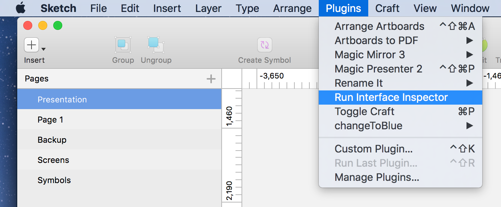

Interface Inspector Enabler for Sketch
---

Apple introduced __System Integrity Protection (SIP)__ since OSX El Capitan.

This affects Interface Inspector to inspect Sketch on System that has SIP enabled which is on by default.

User either has to disable SIP system-wide, which is unpreferable, or to inject the InterfaceInspectorRemote.framework to specific application you wanted to inspect.

This Plugin does exactly that, and also automatically launches Interface Inspector when run.

Download and Install latest version at the [release page](/MagicSketch/InterfaceInspectorRemote/releases)

## Requirements

- OSX El Capitan or above
- Interface Inspector v2.2 (17)

## Run

- Use shortcut

`cmd shift control i`

- Or Use the Menu

